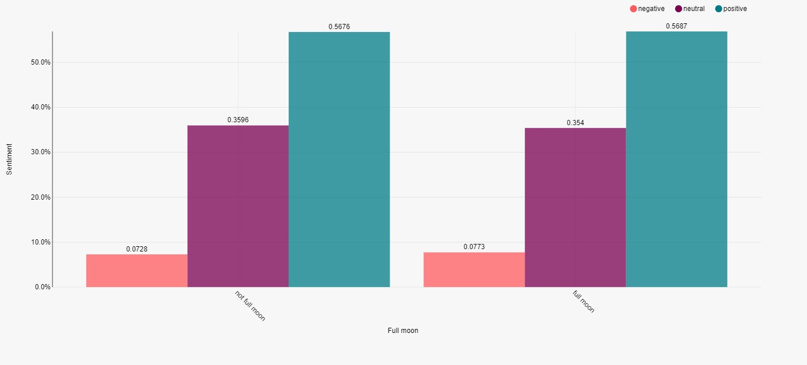
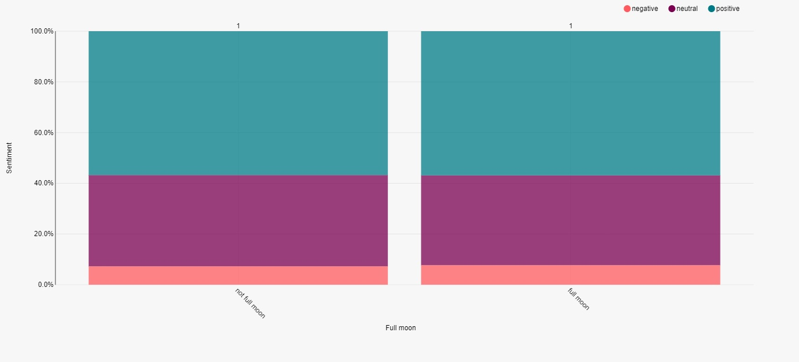
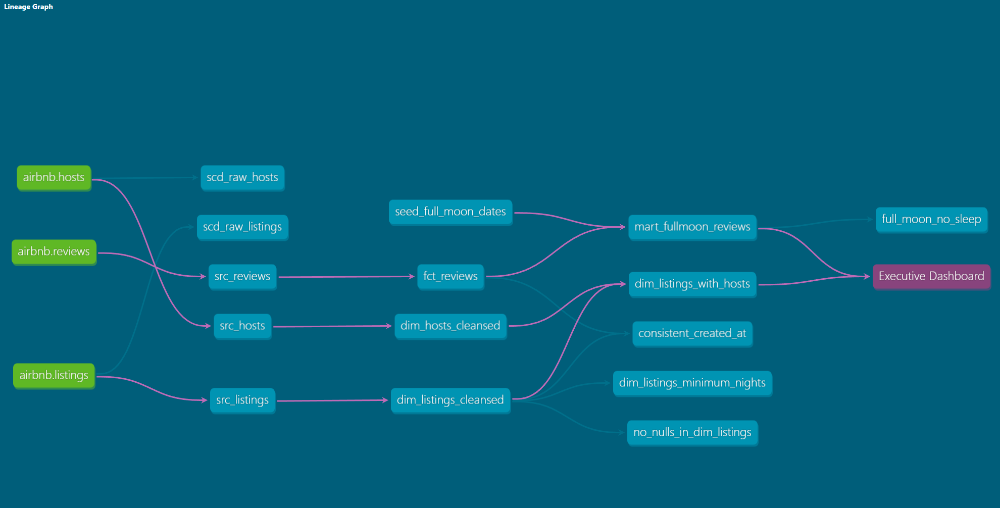
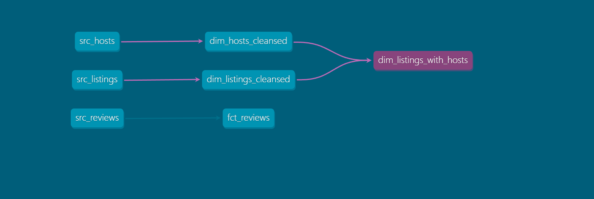

# Title: [Data Analysis of Airbnb Berlin](http://insideairbnb.com/berlin/)
### _ELT data pipeline in Snowflake_


---
## Description: 
Implementation of an ELT pipeline using dbt and Snowflake. Features the following:
- [x] Type - 2 slowly changing dimensions(SCDs)
- [x] Data transformations
- [x] Common table expressions(CTEs)
- [x] dbt models
- [x] dbt materialization
- [x] dbt tests
- [x] dbt documentation
- [x] dbt sources, seeds, snapshots
- [x] dbt hooks and operations
- [x] Jinja and macros
- [x] dbt packages
- [x] Analyses and exposures
- [x] dbt seeds
- [x] Data visualization using Preset BI
- [x] Debugging tests in dbt

## Software/Tools Utilised
- [x] Windows 10
- [x] [Snowflake](https://www.snowflake.com/login/)
- [x] [Python](https://www.python.org/downloads/release/python-3913/)
- [x] [dbt](https://docs.getdbt.com/)
- [x] [Preset business intelligence](https://preset.io/use-cases/internal-bi/)


## Running the project
```
# runs the SQL SELECT statements in the models using a materialization strategy
dbt run

# runs tests defined on models, sources, snapshots, and seeds
dbt test

# rebuild incremental models
dbt run --full-refresh

# rebuild incremental model(fct_reviews)
dbt run --full-refresh --select fct_reviews

# load csv files located in the seeds directory into Snowflake
dbt seed

# generates executable SQL from source model, test, and analysis files
dbt compile

# queries source tables and checks for freshness of those tables
dbt source freshness

# executes the snapshots defined in the snapshots directory
dbt snapshot

# install package(deps: dependencies)
dbt deps

# generate documentation
dbt docs generate

# generates executable SQL from source model, test, and analysis files. Store these compiled SQL files in the target/ directory of the project
dbt compile
```

---

*Screenshots* 

 |  
-------------------------- | --------------------------
 | 


## Credits 
* [Udemy instructor's: Zoltan C. Toth & Miklos Petridisz](https://www.udemy.com/course/complete-dbt-data-build-tool-bootcamp-zero-to-hero-learn-dbt/?referralCode=659B6722C93EF4096D11)
